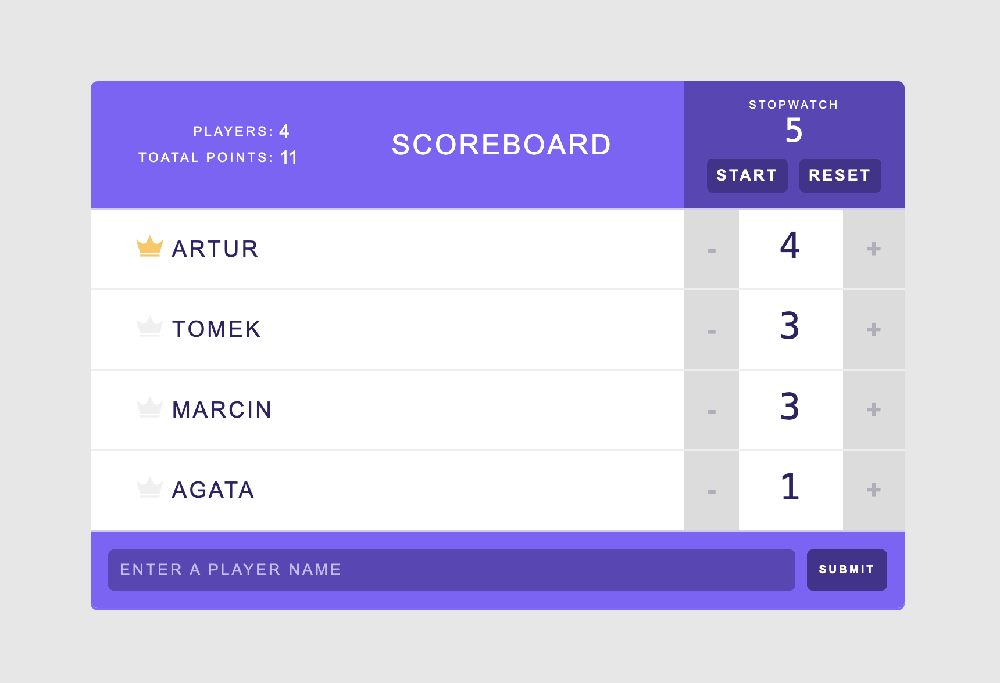

# 🏆 Scoreboard App
This is a simple yet functional Scoreboard App that allows you to manage a list of players, track their points, and even use a built-in stopwatch to time games or activities. It’s an excellent tool for any small team game or challenge where scoring and timing are needed. 
Check it out live here: [Scoreboard App](https://magdamie.github.io/scoreboard/)

## 📸 Preview
 
## ⚙️ How It Works
**Add a Player:** Enter a player's name in the input field and click "Submit" The player will appear in the scoreboard with an initial score of 0 points. 
**Update Points:** Click the "+" or "-" buttons next to a player to add or remove points. 
**Remove a Player:** Click "x" next to a player's name to delete them from the scoreboard. 
**Use the Stopwatch:** Start and stop the built-in stopwatch to track time during games or challenges. 

## 💻 🛠 Technologies Used
- React: For building the UI and managing the state. 
- CSS: For basic styling of the app. 
- React Hooks: For managing state and logic related to players, points, and the stopwatch. 

## 📚 What I Learned
- State Management: Using React's useState and useReducer for managing player data and points.
- React Timer: Implementing a stopwatch with React to manage time and update the UI accordingly.
- Event Handling: Handling user interactions for adding/removing players, updating points, and controlling the stopwatch.
- Component Composition: Building reusable components for displaying players, points, and the stopwatch.
